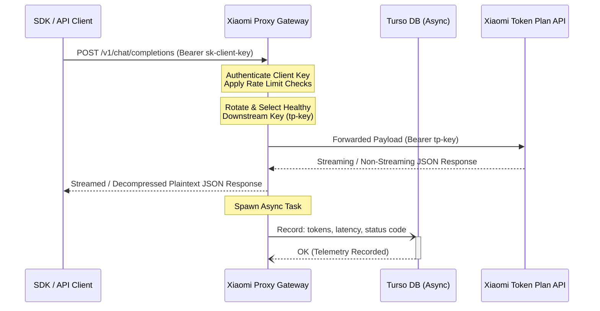

# Xiaomi Reverse Proxy (Xiaomi Mimo API Gateway)

A high-performance, production-ready, lightweight reverse proxy written in Rust that allows you to interface standard OpenAI-compatible and Anthropic-compatible clients with the **Xiaomi Mimo Token Plan** API.

The proxy handles authentication, load-balancing/rotation of downstream provider keys, rate-limiting per client key, and asynchronous logging of detailed usage statistics (latencies, token counts, status codes) to a remote Turso (LibSQL) database.

---

## Key Features

- 🔄 **Protocol Translation**: Wire-compatible with OpenAI chat completions (`/v1/chat/completions`), embeddings (`/v1/embeddings`), models (`/v1/models`), and Anthropic messages (`/anthropic/v1/messages`).
- ⚡ **Asynchronous SQLite/Turso Logging**: Usage telemetry is logged out-of-band to a Turso database, ensuring no added latency for incoming client API requests.
- 🔀 **Weighted Round-Robin Rotation**: Distributes traffic across multiple downstream Xiaomi Token Plan keys, with custom routing weights.
- ❄️ **Failure Cooling / Circuit Breaker**: Automatically tracks key failure rates; if a downstream key returns errors, the proxy temporarily cools it down to avoid serving bad requests.
- 🛡️ **Rate Limiting & Authentication**: Protects the gateway using custom Bearer tokens/API keys (`x-api-key` or `Authorization`) with token-bucket rate-limiting.
- 🐳 **Secure Distroless Docker Image**: Multi-stage build utilizes `cargo-chef` for rapid build-caching, generating a tiny, secure image running on Google's `gcr.io/distroless/cc-debian12`.

---

## Architectural Workflow

The client submits standard OpenAI or Anthropic SDK payloads. The proxy intercepts, validates, applies rate limits, swaps client credentials with the next available healthy downstream Xiaomi Token Plan key, and forwards it.



---

## Configuration & Environment Setup

The proxy can be configured via a file (`config.toml`) or entirely through environment variables, which is ideal for PAAS platforms (Railway, Render, Fly.io, Heroku). Environment variables override config file values.

### Option 1: Using `config.toml`

Copy the template file to configure local variables:
```bash
cp config.example.toml config.toml
```

Example configuration schema (`config.toml`):
```toml
[server]
host = "0.0.0.0"
port = 8080

[downstream]
openai_base_url = "https://token-plan-sgp.xiaomimimo.com/v1"
anthropic_base_url = "https://token-plan-sgp.xiaomimimo.com/anthropic"
timeout_secs = 120
max_retries = 3
retry_base_ms = 500

# Client keys issued to your proxy users
[[client_keys]]
key = "sk-client-key-1"
[[client_keys]]
key = "sk-client-key-2"

# Rotating pool of downstream Xiaomi Token Plan keys
[[downstream_keys]]
key = "tp-xiaomi-token-plan-key-1"
weight = 5   # Custom routing weight
[[downstream_keys]]
key = "tp-xiaomi-token-plan-key-2"
weight = 1

[rate_limit]
requests_per_minute = 60
burst_size = 60

[database]
# Turso Database Configuration (automatically runs schema migrations on startup)
url = "libsql://your-db-name.turso.io"
token = "your-turso-jwt-token"
```

### Option 2: Using Environment Variables (`.env`)

For cloud PAAS or container environments, you can manage everything without a config file using the following variables:

| Variable | Description | Default |
| :--- | :--- | :--- |
| `XIAOMI_PROXY_PORT` | The port the proxy server listens on. | `8080` |
| `XIAOMI_PROXY_HOST` | The network interface the proxy server binds to. | `0.0.0.0` |
| `XIAOMI_PROXY_OPENAI_URL` | The downstream Xiaomi OpenAI endpoint. | `https://token-plan-sgp.xiaomimimo.com/v1` |
| `XIAOMI_PROXY_ANTHROPIC_URL` | The downstream Xiaomi Anthropic endpoint. | `https://token-plan-sgp.xiaomimimo.com/anthropic` |
| `XIAOMI_PROXY_CLIENT_KEYS` | Comma-separated list of Bearer tokens permitted to access this proxy. | None (Required) |
| `XIAOMI_PROXY_DOWNSTREAM_KEYS` | Comma-separated list of keys rotated when sending to Xiaomi. | None (Required) |
| `TURSO_DATABASE_URL` | Turso remote URL (`libsql://...`) or path to a local SQLite file. | `local.db` |
| `TURSO_AUTH_TOKEN` | Auth token for remote Turso DB. | Empty |

---

## How to Run

### 1. Locally (Cargo)

Ensure you have [Rust](https://www.rust-lang.org/tools/install) installed, then run:
```bash
cargo run
```

### 2. Docker Container

Build the secure, optimized Distroless image:
```bash
docker build -t xiaomi-proxy .
```

Run using environment variables:
```bash
docker run -d \
  -p 8080:8080 \
  -e XIAOMI_PROXY_CLIENT_KEYS="sk-custom-client-key" \
  -e XIAOMI_PROXY_DOWNSTREAM_KEYS="tp-your-mimo-key" \
  -e TURSO_DATABASE_URL="libsql://your-db.turso.io" \
  -e TURSO_AUTH_TOKEN="your-token" \
  --name xiaomi-proxy-container \
  xiaomi-proxy
```

---

## API Usage & Integration

All requests to the proxy must contain a configured client key in either the `Authorization` header (`Bearer <key>`) or the `x-api-key` header.

### 🌟 Model Naming Alert
> [!IMPORTANT]
> The downstream Xiaomi Mimo endpoint does not support standard OpenAI model names (like `gpt-4o` or `gpt-3.5-turbo`) or Anthropic model names (like `claude-3-5-sonnet`). You **must** request Xiaomi Mimo's specific model identifiers.
>
> Common Xiaomi model identifiers:
> - `mimo-v2.5`
> - `mimo-v2-omni`

### 1. OpenAI Chat Completions (Stream & Non-Stream)

Request:
```bash
curl -i -X POST http://localhost:8080/v1/chat/completions \
     -H "Authorization: Bearer sk-your-client-key" \
     -H "Content-Type: application/json" \
     -d '{
       "model": "mimo-v2.5",
       "messages": [{"role": "user", "content": "Explain Rust ownership in 1 sentence."}],
       "stream": false
     }'
```

Response:
```json
{
  "id": "chatcmpl-123456789",
  "object": "chat.completion",
  "created": 1716912345,
  "model": "mimo-v2.5",
  "choices": [
    {
      "index": 0,
      "message": {
        "role": "assistant",
        "content": "Rust ownership manages memory through a system of rules enforced at compile time, ensuring safety without a garbage collector."
      },
      "finish_reason": "stop"
    }
  ],
  "usage": {
    "prompt_tokens": 15,
    "completion_tokens": 22,
    "total_tokens": 37
  }
}
```

### 2. Anthropic Messages (Stream & Non-Stream)

Request:
```bash
curl -i -X POST http://localhost:8080/anthropic/v1/messages \
     -H "x-api-key: sk-your-client-key" \
     -H "Content-Type: application/json" \
     -d '{
       "model": "mimo-v2.5",
       "messages": [{"role": "user", "content": "Hello!"}],
       "max_tokens": 1024
     }'
```

### 3. Server Health check

Validates that the proxy is operational and accepts requests.
```bash
curl -i -H "Authorization: Bearer sk-your-client-key" http://localhost:8080/health
```

---

## Admin & Telemetry Endpoints

These endpoints require the same client-key authorization headers to access.

### 📊 1. Query Asynchronous Usage Metrics
Retrieves aggregate usage metrics from the remote Turso DB. Supports filtering by `key`, `model`, and date ranges (`from` and `to` formatted as `YYYY-MM-DD`).

```bash
curl -H "Authorization: Bearer sk-your-client-key" \
     "http://localhost:8080/admin/usage?from=2026-05-01&to=2026-05-31"
```

Expected JSON response:
```json
{
  "period": { "from": "2026-05-01", "to": "2026-05-31" },
  "records": [
    {
      "date": "2026-05-28",
      "client_key": "sk-client-key-1",
      "model": "mimo-v2.5",
      "request_count": 42,
      "total_prompt_tokens": 1280,
      "total_completion_tokens": 2045,
      "total_tokens": 3325
    }
  ]
}
```

### 🔑 2. Downstream Key Status
Returns the state of the rotating downstream key pool, including success/failure history, weights, and temporary cool-down states.

```bash
curl -H "Authorization: Bearer sk-your-client-key" http://localhost:8080/admin/keys
```

Expected JSON response:
```json
{
  "downstream_keys": [
    {
      "key": "tp-sh7s...nrsk",
      "weight": 1,
      "failure_count": 0,
      "consecutive_failures": 0,
      "cooldown_until": null
    }
  ],
  "total": 1,
  "healthy": 1
}
```

---

## SDK Integration Examples

You can easily plug the proxy into standard programming SDKs by updating the `base_url` / `api_base` parameters.

### Python (OpenAI SDK)

```python
import openai

# Configure client to point to the reverse proxy
client = openai.OpenAI(
    api_key="sk-your-client-key",
    base_url="http://localhost:8080/v1"
)

response = client.chat.completions.create(
    model="mimo-v2.5",
    messages=[{"role": "user", "content": "How does reverse proxy help?"}]
)

print(response.choices[0].message.content)
```

### Node.js (OpenAI SDK)

```javascript
import OpenAI from 'openai';

const openai = new OpenAI({
  apiKey: 'sk-your-client-key',
  baseURL: 'http://localhost:8080/v1'
});

async function main() {
  const completion = await openai.chat.completions.create({
    messages: [{ role: 'user', content: 'Hello proxy!' }],
    model: 'mimo-v2.5',
  });

  console.log(completion.choices[0].message.content);
}

main();
```

---

## Development & Contribution

1. **Verify local builds**:
   ```bash
   cargo build --release
   ```
2. **Format files**:
   ```bash
   cargo fmt --all
   ```
3. **Clippy (Linter)**:
   ```bash
   cargo clippy --all-targets --all-features -- -D warnings
   ```
